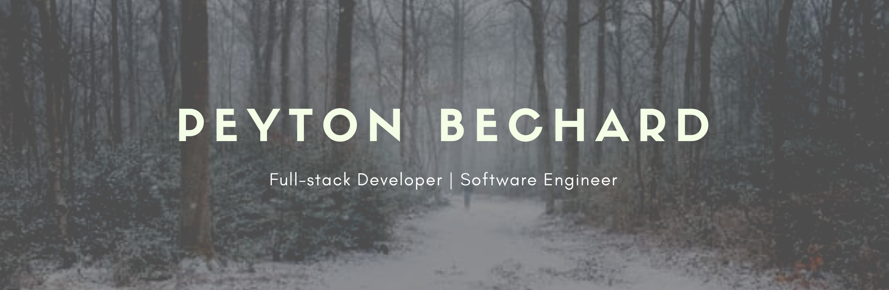

  
  
  

 
<h2 align="center">Introduction</h2>

My name is Peyton Bechard and I am a self-taught developer with 2 YOE. Currently looking for a remote position.
  

 

  

 

- 🔭 I’m currently working on expanding my knowledge of full-stack web development.
- 🌱 I’m currently learning React.
- 💬 Ask me about my experience teaching AP CS A and AP CS P in China and working as a tour manager in North Korea!
- ⚡ Fun fact: I'm also a synthesizer hobbyist and try to make at least one short track every day.

 
<h2 align="center">Frequently Used Technologies</h2>

     
  
     
  
  
  
  
  
  

  

  
  
  

 

  

 
 

Feel free to reach out. Thanks for visiting!</h2>
